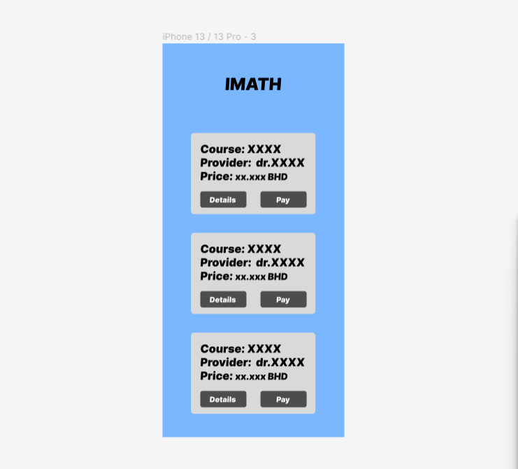
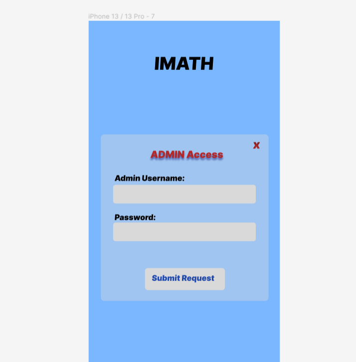

# Project3-IMATH

## IMATH (Courses registration platform at IMATH institute):
#### it is a simple website that dose not require the user to login, it views Courses provided with details. 
#### Admins are the only ones who are able to login, they can add courses, add instructor.

## Screenshot(s): 

## Technologies Used:
               

## Links:
[Figma framework](https://www.figma.com/file/tjDqhfERGZJH8P7OmnNwUs/IMATH?type=design&node-id=0%3A1&mode=design&t=oAe0UiEPxWjMiJ1b-1)

[Trello Bourd link](https://trello.com/invite/b/RizRcIOa/ATTIb22341f3ccf2690865c24be297430a43C5759CF2/project-4)

[Github Link link](https://git.generalassemb.ly/zainabjalil/Project-4-IMATH.git)

## Next Steps: 

### [1] Admin Add Functions features should be working in the frontend.
### [2] user able to pay for courses
### [3] user is able to see map location for the course when they view the details of it.

<!-- # Technical Requirements -->